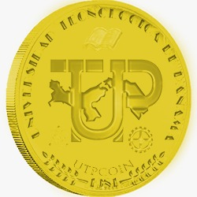

.. UTPWallet documentation master file, created by
   sphinx-quickstart on Sun Jul 15 15:25:35 2018.
   You can adapt this file completely to your liking, but it should at least
   contain the root `toctree` directive.

Welcome to UTPWallet's documentation!
=====================================

.. toctree::
   :maxdepth: 1
   :caption: Contents:

   intro
   utp
   pollo
   modules

Indices and tables
==================

* :ref:`genindex`
* :ref:`modindex`